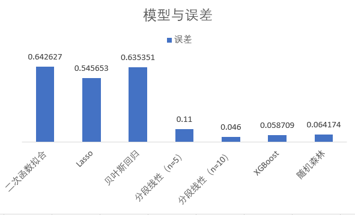
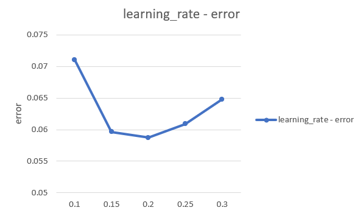
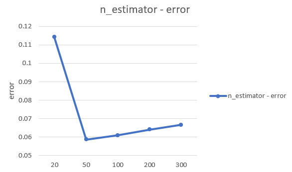
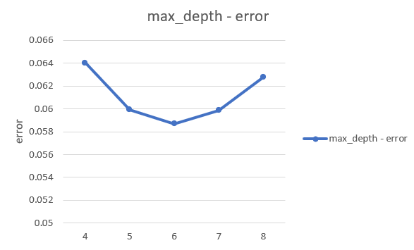

# BinaryCrossEntropy算子模型分析报告
## 模型选择
由特征分析可知，该算子有4个有差异的特征，在对多种模型进行尝试后，得出以下结论：
+ 简单的曲线拟合和一些线性模型（如Lasso、贝叶斯回归等）效果较差，不能满足要求
+ 分段线性模型在断点数高（n_breakpoint>10）的时候效果最优，但训练所花时间极长，不满足要求
+ xgboost和随机森林效果较好，得到的精度较高，所需时间也很短  

最终选择xgboost作为最终的模型
## 模型调优
经过测试，对模型表现影响较大的超参数有learning_rate、n_estimators、max_depth，调优也主要调整这些参数  
参数与精度的关系如下列图表  
  
  
  
根据以上数据，最终采用超参数为learning_rate=0.2, n_estimators=50, max_depth=8