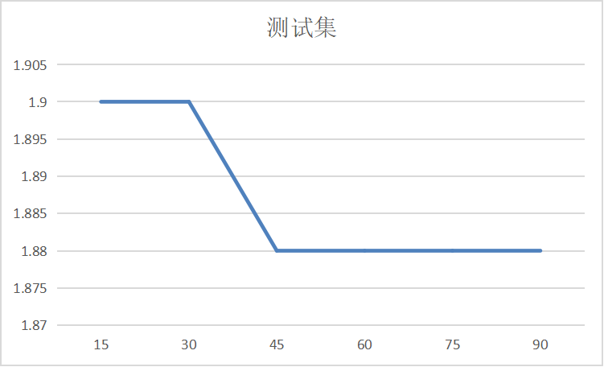

# InstanceNorm算子模型分析报告
## 模型选择
+ 结合《算子特征分析报告》，阐述选择模型的理由
  该模型共尝试了两种建模方式RandomForestRegressor和XGBRegressor

  XGBRegressor速度快、效果好、能处理大规模数据
  
  RandomForestRegressor对数据集的适应能力强, 既能处理离散型数据，也能处理连续型数据; 能处理高维特征，不容易产生过拟合
  
## 模型调优
+ 讨论不同的算子特征、模型类别和模型性能的关系，绘制相关曲线图
+ 可以对比多个模型，选择最终的选型。优先选择复杂度低，容量小的模型

根据算子特征分支报告, 选择的最合适的特征为:

| 特征 | 说明|
|----|--------|
| x | np.prod(x_shape), 输入x_shape的乘积|
| fc_shape1 | np.prod(x_shape) / np.prod(y_shape), axes指定维度的乘积|
| y |np.prod(y_shape), 输出y_shape的乘积 | 
| is_float16 |int(x['dtype'].lower() == "float16") |
| is_float |int(x['dtype'].lower() == "float")) |

下面是对XGBRegressor和RandomForestRegressor的调参过程分析

+ XGBRegressor
  + 固定其余参数值如下, 对n_estimators进行调参
    
    | 参数 | 参数值|
    |----|--------|
    | learning_rate | 0.15|
    | n_estimators | ?|
    | max_depth | 3|
    | subsample | 0.7|
    | colsample_bytree | 0.8|
  
    n_estimators=320时, 80_percentage_error最小，而且随着n_estimators的增大训练时间只会变长但80_percentage_error却没有明显下降.
  
    
    

  + 固定其余参数值如下, 对max_depth进行调参

    | 参数 | 参数值|
    |----|--------|
    | learning_rate | 0.15|
    | n_estimators | 320|
    | max_depth | ? |
    | subsample | 0.7|
    | colsample_bytree | 0.8|

    max_depth从3变化到20总体对80_percentage_error的值影响不大, max_depth=3时, 80_percentage_error最小, 增大max_depth,80_percentage_error有增大趋势.

    
     

  + 固定其余参数值如下, 对subsample进行调参

    | 参数 | 参数值|
    |----|--------|
    | learning_rate | 0.15|
    | n_estimators | 320|
    | max_depth | 3|
    | subsample | ? |
    | colsample_bytree | 0.9| 
  
    subsample控制对于每棵树，随机采样的比例. 减小这个subsample的值，算法会更加保守, 避免过拟合. 但是，如果这个值设置得过小，它可能会导致欠拟合。
    典型值：0.5-1, 0.5代表平均采样, 这里subsample值得变化对80_percentage_error影响变化不大, 0.7在训练集上和测试集表现最好,这里选择 subsample=0.7.
    
    
      
    
  + 固定其余参数值如下, 对colsample_bytree进行调参
  
    | 参数 | 参数值|
    |----|--------|
    | learning_rate | 0.15|
    | n_estimators | 320|
    | max_depth | 3|
    | subsample | 0.7 |
    | colsample_bytree | ?| 
  
    colsample_bytree用来控制每棵随机采样的列数的占比(每一列是一个特征). 典型值: 0.5-1, 这里colsample_bytree小于0.8时的取值，80_percentage_error持续下降,
    相对来说colsample_bytree=0.8时在测试集上表现刚好, 这里取colsample_bytree=0.8.
  
     
         
  
  + 固定其余参数值如下, 对learning_rate进行调参
  
    | 参数 | 参数值|
    |----|--------|
    | learning_rate | ?|
    | n_estimators | 320|
    | max_depth | 20|
    | subsample | 0.7 |
    | colsample_bytree | 0.8|  
  
    learning_rate是每一步迭代的步长，很重要, 太大了运行准确率不高，太小了运行速度慢. 这里我们看到此时learningrate越大，80_percentage_error越大，故选用0.15作为最终值.
  
    
    
  
  + 通过调参对比, 最终固定XGBRegressor参数值如下
    
    | 参数 | 参数值|
    |----|--------|
    | learning_rate | 0.15|
    | n_estimators | 320|
    | max_depth | 3|
    | subsample | 0.7 |
    | colsample_bytree | 0.8|
  
    XGBRegressor最好效果如下:
  
    | 建模算子 | 训练集大小 | 80_percentage_error(取k折交叉验证的平均值) | 测试集大小 | 80_percentage_error | 模型超参数 |
    |------|-------|----------------------------------|-------|---------------------|------|
    |  InstanceNorm  |   1500    |       2.04                           |   1500    |       1.85              | learning_rate=0.15, n_estimators=320, max_depth=3, subsample=0.7, colsample_bytree=0.8   |
  
+ RandomForestRegressor
  + 固定其余参数值如下, 对n_estimators进行调参  
    
    | 参数 | 参数值|
    |----|--------|
    | n_estimators | ?|
    | max_depth | 45|
    
    可以从图中看到n_estimators=200时效果测试集效果最佳，n_estimators=400时训练集效果最佳，但训练时间过长，故采用n_estimators=200.
    
    
     
  
  + 固定其余参数值如下, 对max_depth进行调参  

    | 参数 | 参数值|
    |----|--------|
    | n_estimators | 200|
    | max_depth | ?|
    
    取max_depth=45, 增大max_depth后80_percentage_error值几乎没有变化.
    
    
    

  + 通过调参对比, 最终固定RandomForestRegressor参数值如下

    | 参数 | 参数值|
    |----|--------|
    | n_estimators | 200
    | max_depth | 45|

    RandomForestRegressor最好效果如下:
  
    | 建模场景 | 训练集大小 | 80_percentage_error(取k折交叉验证的平均值) | 测试集大小 | 80_percentage_error | 模型超参数 |
    |------|-------|----------------------------------|-------|---------------------|------|
    |  p=0    |   4500    |           1.99                       |    1500   |            1.87         |   n_estimators=200, max_depth=45   |   
+ 结论
  最终建模效果RandomForestRegressor和XGBRegressor差别不大, 但是考虑XGBRegressor速度快, 模型容量更小, 且在建模的过程中我尝试了对4500条p=2场景训练数据建模, 发现XGBRegressor对大数据的建模效果会更好, 因此最终选择XGBRegressor模型