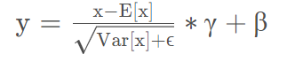

# 算子特征分析报告

## 算子说明
**算子功能**

InstanceNorm: 对使用mini batch和具有可学习参数的数据模型进行重缩放和特征重调整。
公式：

  

**算子约束**

说明算子约束（如算子输入输出取值范围，内存限制等）

| 变量 | 类型|datatype | format | shape | 取值范围|
|----|--------|--------|-----|-----|-----|
| input | 输入|float16、float | ND|>=3|all|
| gamma | 输入| float16、float|- |input[1]|all|
| beta |输入 | float16、float| -|-|all|
| data_format |属性 |float16、float | -|-|ND|
| epsilon |属性 |float, default:1e-12  | -|-|all|
| output |输出 |float16、float | ND|同input| all |
| mean |输出 |float16、float | ND|同input| all |
| variance |输出 |float16、float | ND|同input| all |

## 特征选择
**说明特征选择的理由，包括但不限于：**

根据公式，输入x与均值做差，该减法操作计算量为x的元素个数；方差与标量求和，计算量为方差的元素个数...类似地，可得出各特征的计算量。
由此可见特征主要包括

| 特征 | 说明|重要性 |
|----|--------|--------|
| x | np.prod(x_shape), 输入x_shape的乘积|0.073494  |
| x_mean | np.prod(mean_shape), 输出mean_shape的乘积         | 0.071685 |
| y |np.prod(y_shape), 输出y_shape的乘积 | 0.069854 |
| means |np.prod(mean_shape), 输出mean_shape的乘积 |0.123014 |
| variance |3*np.prod(variance_shape), 输出variance_shape的乘积的三倍 |0.053220 |
| variance_e |np.prod(variance_shape), 输出variance_shape的乘积 | 0.538009 |
| de |np.prod(x_shape), 输入x_shape的乘积 | 0.071885 |
| mul |np.prod(x_shape), 输入x_shape的乘积 | 0.073312 |
| add |np.prod(x_shape), 输入x_shape的乘积 | 0.073236 |
| is_float16 |int(x['dtype'].lower() == "float16") | 0.014796 |
| is_float |int(x['dtype'].lower() == "float")) | 0.013730 |
