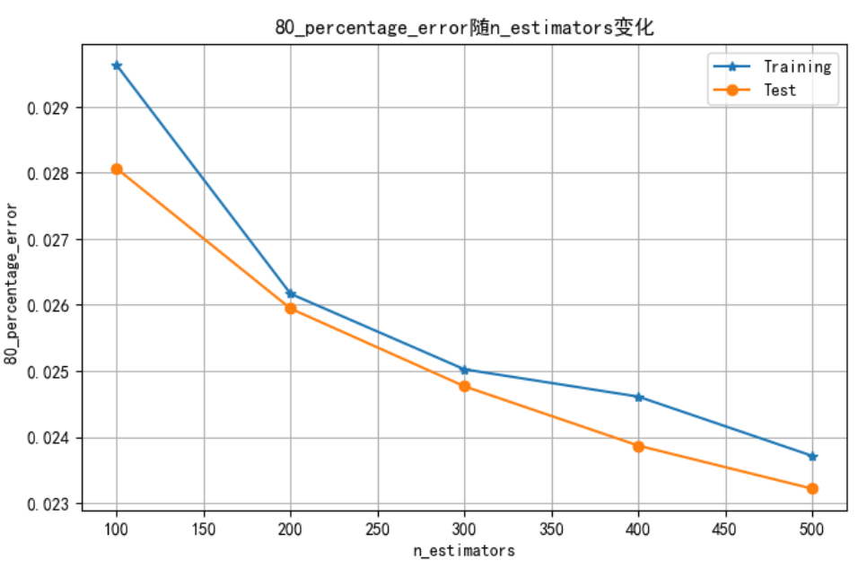
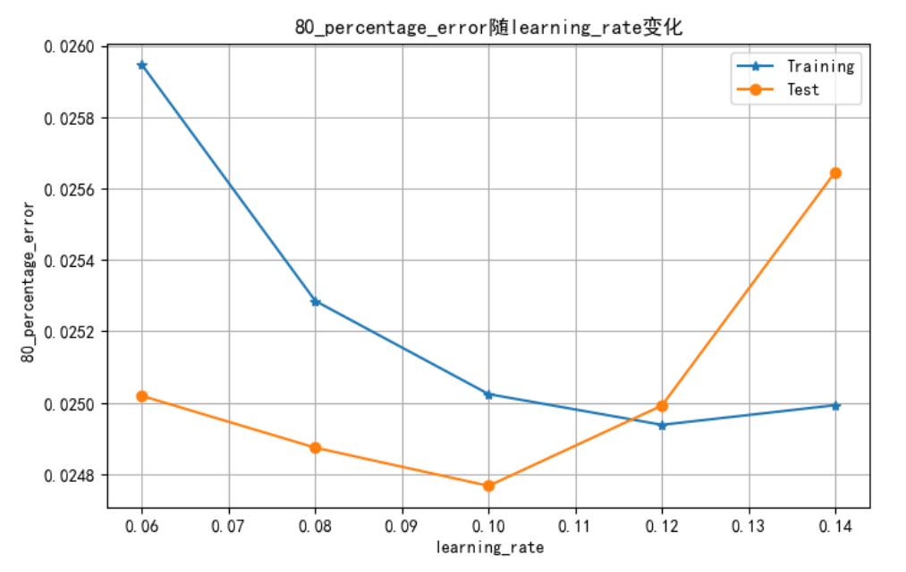
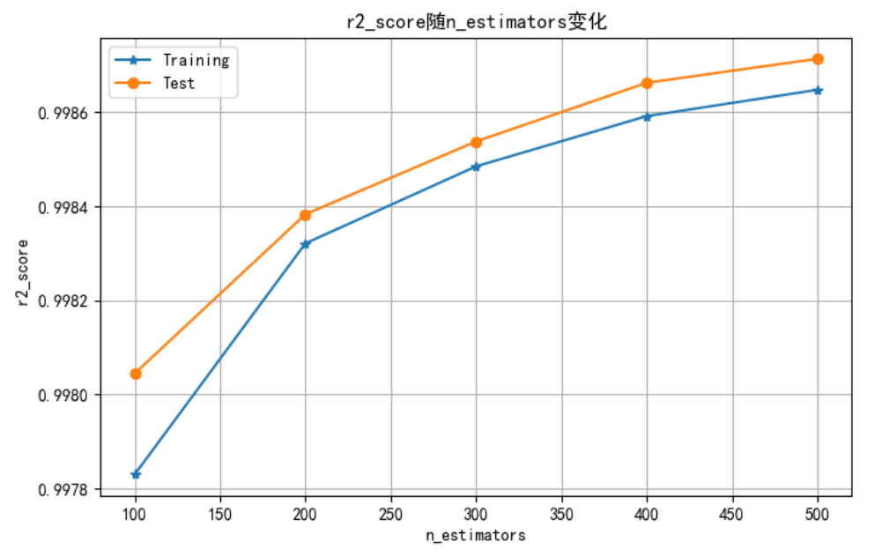
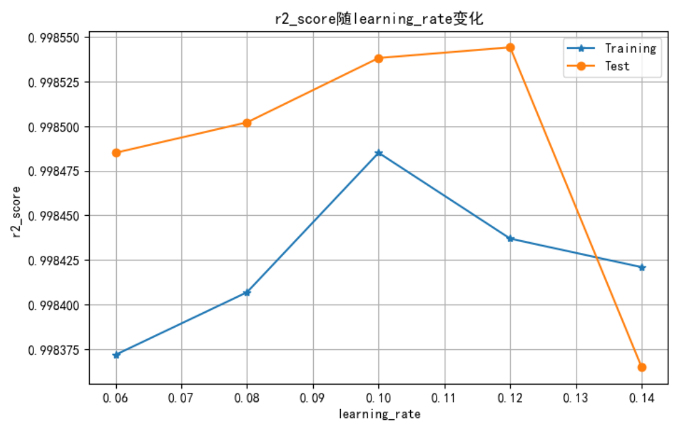

# Iou算子模型分析报告
## 模型选择
+ 结合《算子特征分析报告》，阐述选择模型的理由
  - 模型特征较少，类型单一，较为容易拟合。特征本身较为简单，但又怕过拟合，xgboost回归模型有正则化防止过拟合且能很好地完成建模任务。
## 模型调优
+ 由于xgboost模型较为适合此任务，且初次使用即达到很好的效果，故选择对xgboost模型进行调优。
+ 超参数方面，采用xgboost模型，通过对比不同的learning_rate和n_estimators，的到以下结果
  - 80_percentage_error随n_estimators的变化关系，图片链接：
  - 80_percentage_error随learning_rate的变化关系，图片链接：
  - r2_score随n_estimators的变化关系，图片链接：
  - r2_score随learning_rate的变化关系，图片链接：
+ 通过以上的比较分析可知learning_rate介于0.10与0.12之间时各项指标较好，故learning_rate取0.11；n_estimators与各项指标结果呈正相关，即在实验范围内n_estimators越高，实验结果越好，但指标继续提高的速度持续下降，所以n_estimators取实验范围内的最大值500。

