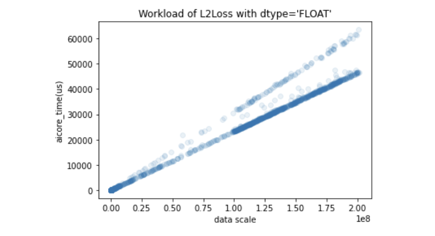
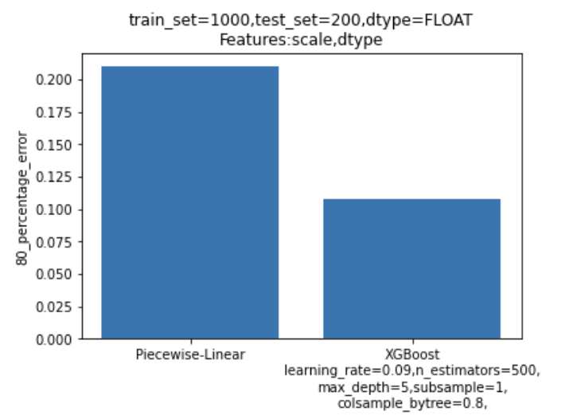
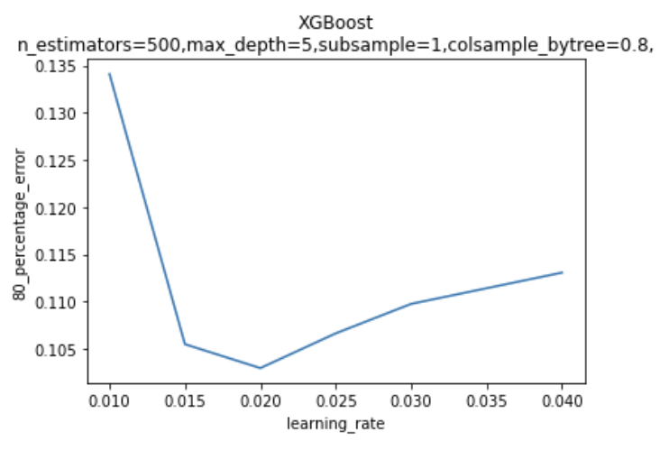
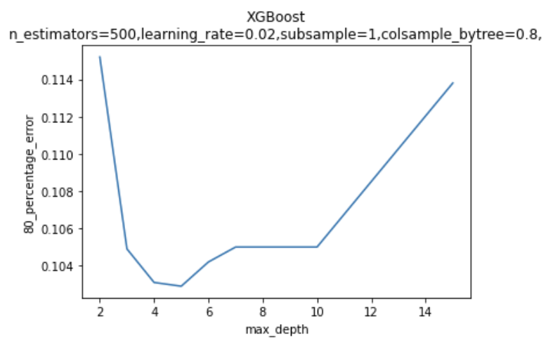
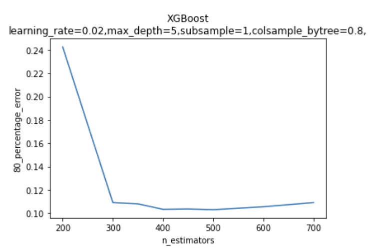
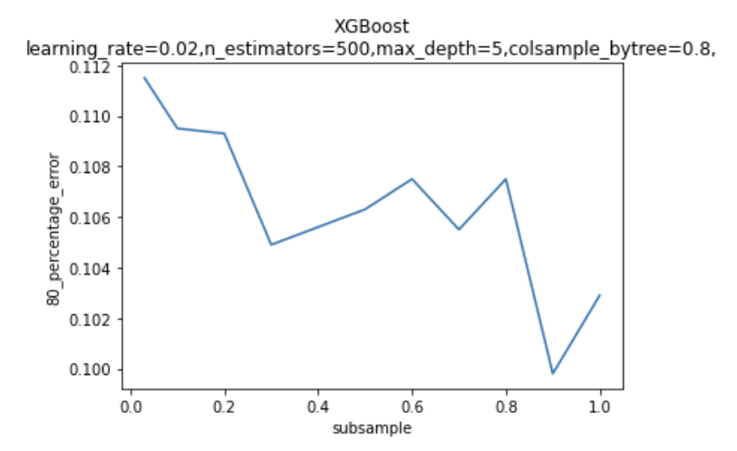
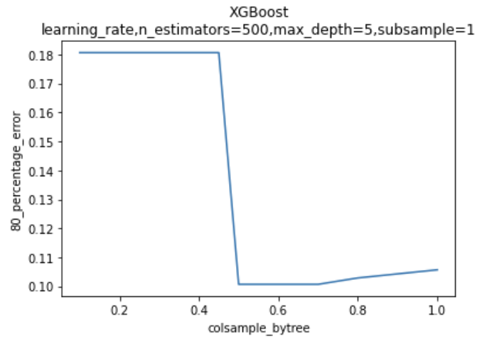

# L2Loss算子模型分析报告
## 模型选择
由下图所示的算子输入规模与运行时间分布情况可知，算子运行时间与输入规模并非呈严格线性关系。\

故使用Piecewise-Linear或LASSO等线性模型并不能很好的拟合数据，而选用XGBoost回归预测模型可获得较好的预测结果。
## 模型调优
### Piecewise-Linear与XGBoost模型预测精度对比

### XGBoost各参数调优
\
\
\
\
\
### 根据上图各超参数取值与80_percentage_error的关系，结合其他评估指标（r2_score等）综合考量，选取超参数{n_estimators=500,learning_rate=0.02,max_depth=5,subsample=1,colsample_bytree=0.8}进行建模。