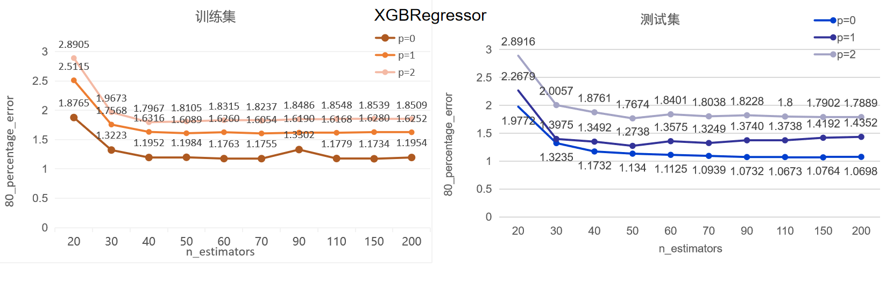
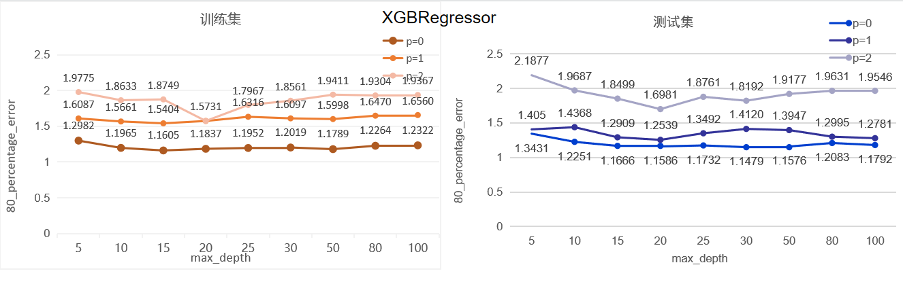
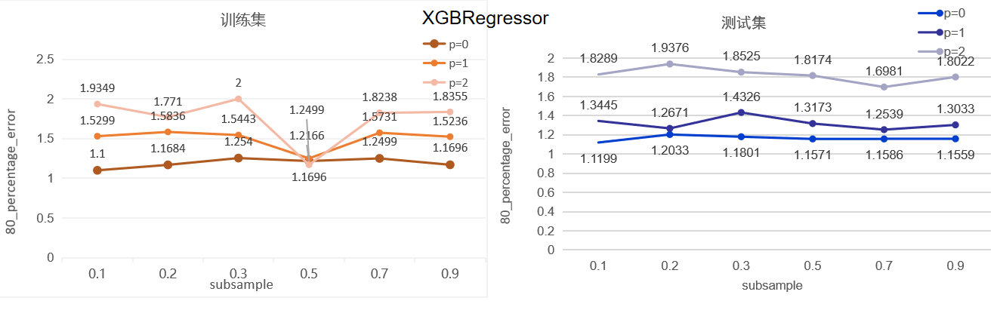
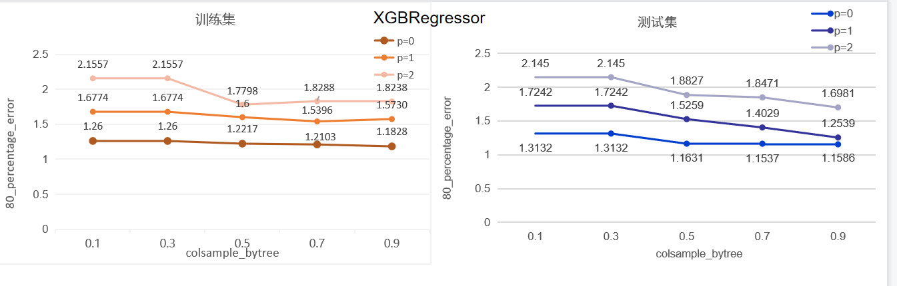
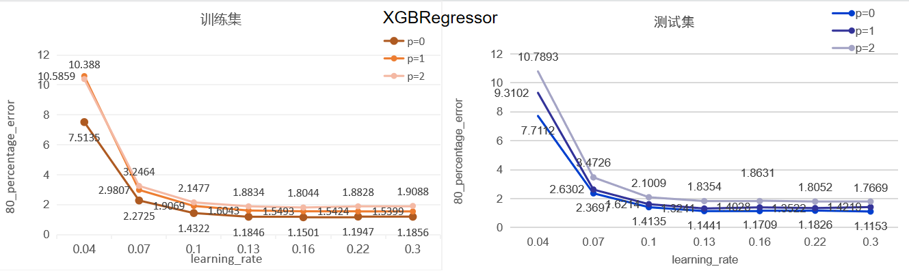
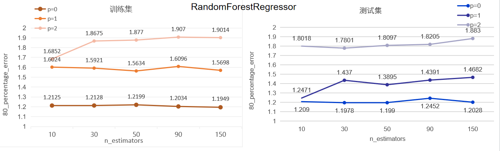
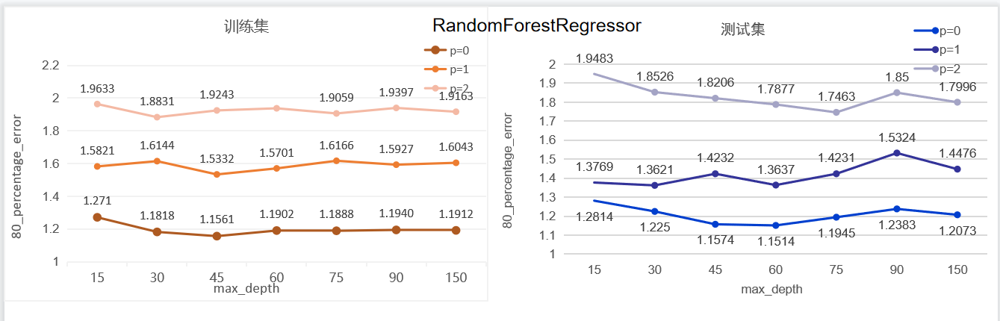

# LpNorm算子模型分析报告
## 模型选择
+ 结合《算子特征分析报告》，阐述选择模型的理由
  该模型共尝试了两种建模方式RandomForestRegressor和XGBRegressor

  XGBRegressor速度快、效果好、能处理大规模数据
  
  RandomForestRegressor对数据集的适应能力强, 既能处理离散型数据，也能处理连续型数据; 能处理高维特征，不容易产生过拟合
  
## 模型调优
+ 讨论不同的算子特征、模型类别和模型性能的关系，绘制相关曲线图（图片请归档于各算子对应的image文件夹下）
+ 可以对比多个模型，选择最终的选型。优先选择复杂度低，容量小的模型

根据算子特征分支报告, 选择的最合适的特征为:

| 特征 | 说明|
|----|--------|
| x | np.prod(x_shape), 输入x_shape的乘积|
| fc_shape1 | np.prod(x_shape) / np.prod(y_shape), axes指定维度的乘积|
| y |np.prod(y_shape), 输出y_shape的乘积 | 
| is_float16 |int(x['dtype'].lower() == "float16") |
| is_float |int(x['dtype'].lower() == "float")) |

下面是对XGBRegressor和RandomForestRegressor的调参过程分析

+ XGBRegressor
  + 固定其余参数值如下, 对n_estimators进行调参
    
    | 参数 | 参数值|
    |----|--------|
    | learning_rate | 0.15|
    | n_estimators | ?|
    | max_depth | 25|
    | subsample | 0.7|
    | colsample_bytree | 0.9|
   
    n_estimators=40时, 80_percentage_error最小，而且随着n_estimators的增大训练时间只会变长但80_percentage_error却没有明显下降.
  
    

  + 固定其余参数值如下, 对max_depth进行调参

    | 参数 | 参数值|
    |----|--------|
    | learning_rate | 0.15|
    | n_estimators | 40|
    | max_depth | ? |
    | subsample | 0.7|
    | colsample_bytree | 0.9|

    max_depth从5变化到100总体对80_percentage_error的值影响不大, max_depth=20时, 80_percentage_error最小, 减小或增大max_depth, 80_percentage_error有增大趋势.

    

  + 固定其余参数值如下, 对subsample进行调参

    | 参数 | 参数值|
    |----|--------|
    | learning_rate | 0.15|
    | n_estimators | 40|
    | max_depth | 20|
    | subsample | ? |
    | colsample_bytree | 0.9| 
  
    subsample控制对于每棵树，随机采样的比例. 减小这个subsample的值，算法会更加保守, 避免过拟合. 但是，如果这个值设置得过小，它可能会导致欠拟合。
    典型值：0.5-1, 0.5代表平均采样, 这里subsample值得变化对80_percentage_error影响变化不大, 0.5在训练集上表现最好, 0.7在测试集上表现更好,
    这里选择 subsample=0.7.
    
    
  
  + 固定其余参数值如下, 对colsample_bytree进行调参

    | 参数 | 参数值|
    |----|--------|
    | learning_rate | 0.15|
    | n_estimators | 40|
    | max_depth | 20|
    | subsample | 0.7 |
    | colsample_bytree | ?| 

    colsample_bytree用来控制每棵随机采样的列数的占比(每一列是一个特征). 典型值: 0.5-1, 这里colsample_bytree大于0.5时的取值对80_percentage_error影响变化不大,
    相对来说colsample_bytree=0.9时在测试集上表现刚好, 这里取colsample_bytree=0.9.

     

  + 固定其余参数值如下, 对learning_rate进行调参

    | 参数 | 参数值|
    |----|--------|
    | learning_rate | ?|
    | n_estimators | 40|
    | max_depth | 20|
    | subsample | 0.7 |
    | colsample_bytree | 0.9|  

    learning_rate是每一步迭代的步长，很重要, 太大了运行准确率不高，太小了运行速度慢. 这里我们看到learning_rate=0.16的时候再增大学习率80_percentage_error也无明显下降，所以这里取learning_rate=0.16
  
    
  
  + 通过调参对比, 最终固定XGBRegressor参数值如下
    
    | 参数 | 参数值|
    |----|--------|
    | learning_rate | 0.16|
    | n_estimators | 40|
    | max_depth | 20|
    | subsample | 0.7 |
    | colsample_bytree | 0.9|

    XGBRegressor最好效果如下:
  
    | 建模场景 | 训练集大小 | 80_percentage_error(取k折交叉验证的平均值) | 测试集大小 | 80_percentage_error | 模型超参数 |
    |------|-------|----------------------------------|-------|---------------------|------|
    |  p=0    |   6474    |       1.1501                           |   1304    |       1.1709              | learning_rate=0.16, n_estimators=40, max_depth=20, subsample=0.7, colsample_bytree=0.9   |  
    |  p=1    |    6712   |            1.5493                      |   1354    |          1.4028           |   learning_rate=0.16, n_estimators=40, max_depth=20, subsample=0.7, colsample_bytree=0.9    |    
    |  p=2    |   6586    |                 1.8044                 |   1340    |           1.8631        |    learning_rate=0.16, n_estimators=40, max_depth=20, subsample=0.7, colsample_bytree=0.9   |    

+ RandomForestRegressor
  + 固定其余参数值如下, 对n_estimators进行调参  
    
    | 参数 | 参数值|
    |----|--------|
    | n_estimators | ?|
    | max_depth | 45|
    
    可以从图中看到n_estimators的变化其实对80_percentage_error变化不大, n_estimators理论上越大越好, 但是n_estimators越大训练时间越长, 为了平衡效果和时长, 这里取n_estimators=30
    
    
  
  + 固定其余参数值如下, 对max_depth进行调参  

    | 参数 | 参数值|
    |----|--------|
    | n_estimators | 30|
    | max_depth | ?|
    
    取max_depth=45, 增大max_depth后80_percentage_error值也不会有明显下降
    
    

  + 通过调参对比, 最终固定RandomForestRegressor参数值如下

    | 参数 | 参数值|
    |----|--------|
    | n_estimators | 30
    | max_depth | 45|

    RandomForestRegressor最好效果如下:
  
    | 建模场景 | 训练集大小 | 80_percentage_error(取k折交叉验证的平均值) | 测试集大小 | 80_percentage_error | 模型超参数 |
    |------|-------|----------------------------------|-------|---------------------|------|
    |  p=0    |   6474    |           1.1561                       |    1304   |            1.1574         |   n_estimators=30, max_depth=45   |   
    |  p=1    |   6712    |              1.5332                   |   1354    |            1.4232        |    n_estimators=30, max_depth=45  |   
    |  p=2    |   6586    |               1.9243                   |    1340   |            1.8206         |     n_estimators=30, max_depth=45 |  

+ 结论
  最终建模效果RandomForestRegressor和XGBRegressor差别不大, 但是考虑XGBRegressor速度快, 模型容量更小, 且在建模的过程中我尝试了对20000条p=2场景训练数据建模, 发现XGBRegressor对大数据的建模效果会更好, 因此最终选择XGBRegressor模型