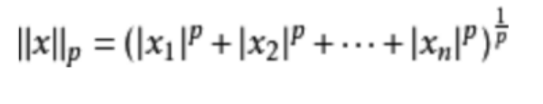

# 算子特征分析报告

## 算子说明
**算子功能**

LpNorm: 返回给定张量的矩阵范数或向量范数
+ p = 0, 统计非0元素的个数
+ p = 1, 计算元素绝对值之和
+ p >= 2, 

  

+ p = inf, 计算元素的最大绝对值
+ p = -inf, 计算元素的最小绝对值

**算子约束**
 
说明算子约束（如算子输入输出取值范围，内存限制等）

  | 变量 | 类型|datatype | format | shape | 取值范围|
  |----|--------|--------|-----|-----|-----|
  | input | 输入|float16、float | ND|无shape限制|all|
  | axes | 属性| ListInt|- |[1, input_rank]|[1 - input_rank, input_rank - 1]|
  | p |属性 | int, default:2| -|-|all|
  | keep_dims |属性 |bool, default:False | -|-|True, False|
  | epsilon |属性 |float, default:1e-12  | -|-|all|
  | output |输出 |float16、float | ND|见下图| 见算子计算公式|

   output输出shape需要根据axes和input的shape推导
+ input_rank=0, output_shape=input_shape

+ input_rank>0, 如果axes中存在负数，先对axes执行 if (axis[i] < 0) { axis[i] += input_rank; }

  | keep_dims | output_shape|
  |----|--------|
  | True | axes指向维度等于1, 其余维度和input_shape同|
  | False | axes指向维度去除, 其余维度保留|

  例如: input_shape[1, 2, 3, 4], axes[1, 2]
  + keep_dims=True, output_shape = [1, 1, 1, 4]
  + keep_dims=False, output_shape = [1, 4]
  
 

## 特征选择
**说明特征选择的理由，包括但不限于：**

以p=2, input_shape = [2,5,6,7], axes = [1, 2]的计算为例, 先执行的是2x5x6x7个数的平方，然后5x6个数累加执行（2x7)次， 最后再执行（2x7)次开方
由此可见特征主要包括

| 特征 | 说明|重要性 | 
|----|--------|--------|
| x | np.prod(x_shape), 输入x_shape的乘积|p=0: 0.249968 ; p=1: 0.265700; p=2: 0.246882;  | 
| fc_shape1 | np.prod(x_shape) / np.prod(y_shape), axes指定维度的乘积|p=0:  0.241803; p=1: 0.197176; p=2: 0.249401; |
| y |np.prod(y_shape), 输出y_shape的乘积 | p=0:  0.264020; p=1: 0.233247; p=2: 0.279009;|
| is_float16 |int(x['dtype'].lower() == "float16") |p=0: 0.134170; p=1: 0.118415; p=2: 0.151763; |
| is_float |int(x['dtype'].lower() == "float")) |p=0: 0.110039; p=1: 0.185462; p=2: 0.072945; |
