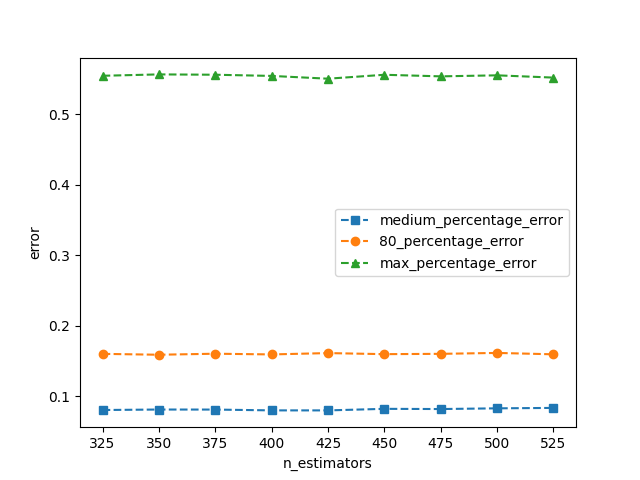
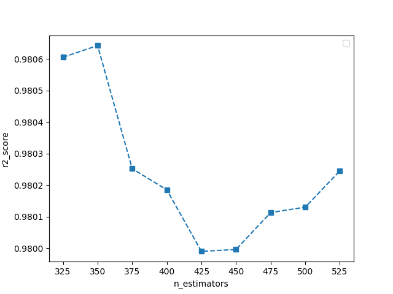
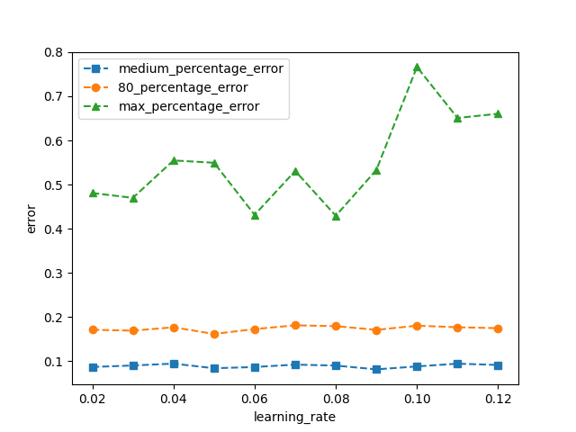
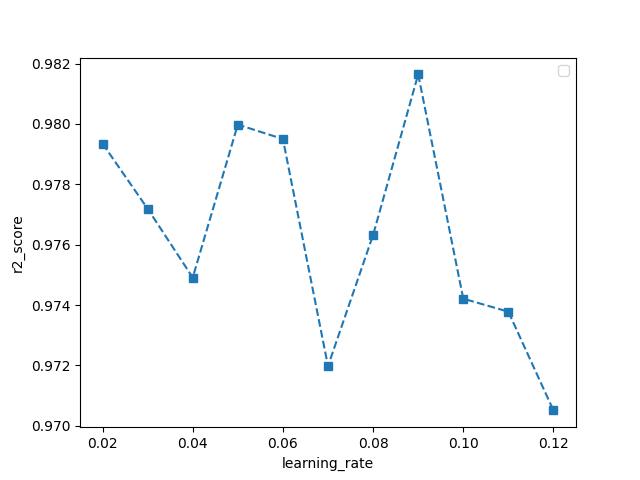
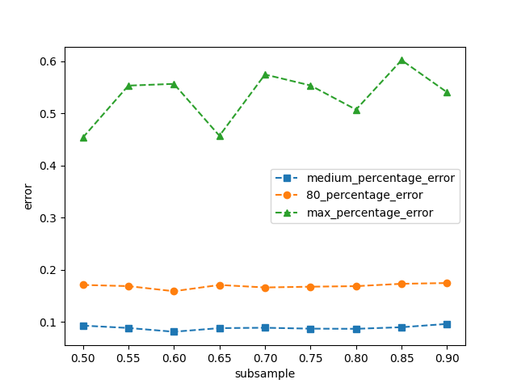
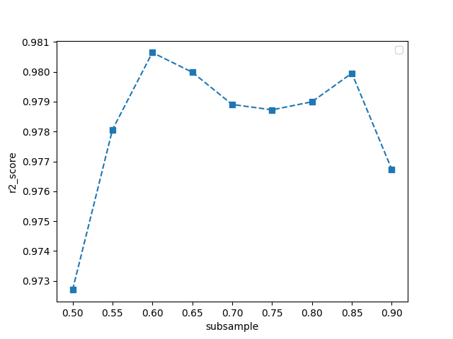
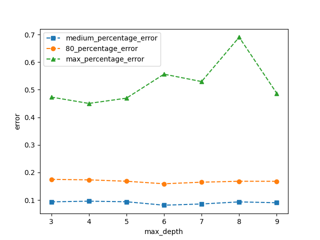
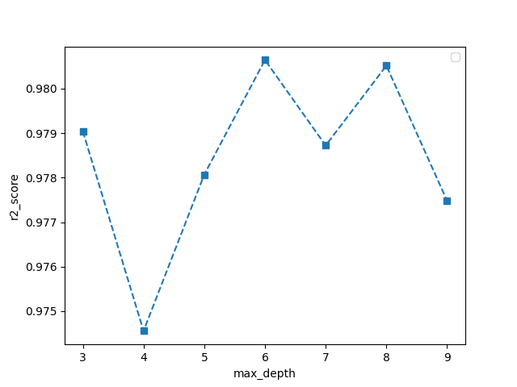

# MaxPool3D算子模型分析报告
## 模型选择
+ 结合《算子特征分析报告》，阐述选择模型的理由
  + MaxPool3D算子特征数量较多，数据类型单一，适用于机器学习模型建模，XGBoost速度快、效果好、能处理大规模数据
## 模型调优
+ 讨论不同的算子特征、模型类别和模型性能的关系，绘制相关曲线图（图片请归档于各算子对应的image文件夹下）
+ 可以对比多个模型，选择最终的选型。优先选择复杂度低，容量小的模型

迭代次数对误差的影响

迭代次数对r2_score的影响

学习率对误差的影响

学习率对r2_score的影响

子样本比例对误差的影响

子样本比例对r2_score的影响

最大深度对误差的影响

最大深度对r2_score的影响

  + 通过以上超参数比较，学习率为0.10, n_estimators=500, max_depth=4, subsample=1, colsample_bytree=0.9, 即可达到较为理想的结果。