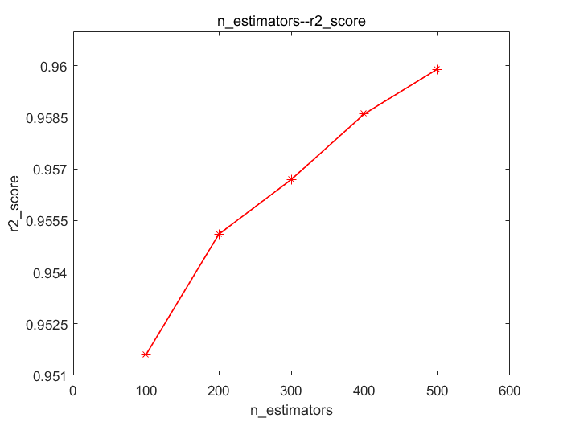
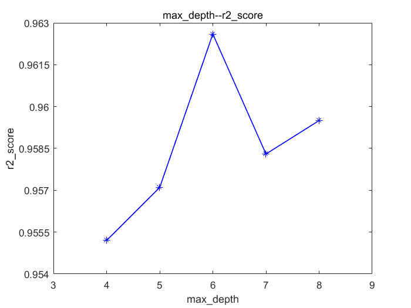
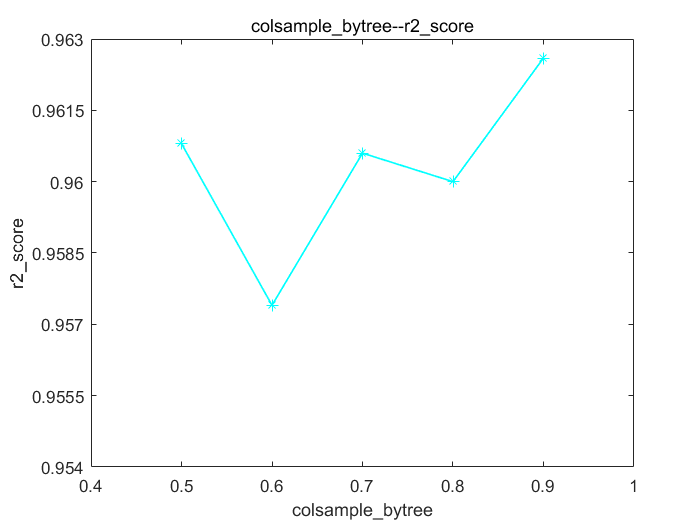
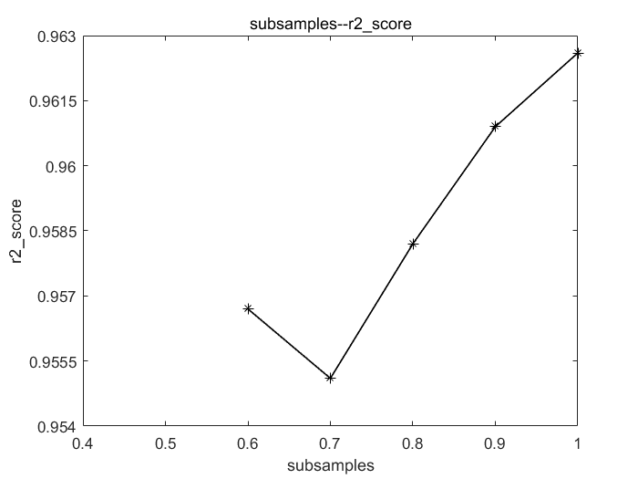

# PadV3算子模型分析报告
## 模型选择
+ 结合《算子特征分析报告》，阐述选择模型的理由
  + 复杂度低，特征数量较多，适用于机器学习模型建模，选用XGBoost回归预测模型可获得较好的效果。
## 模型调优
+ 讨论不同的算子特征、模型类别和模型性能的关系，绘制相关曲线图（图片请归档于各算子对应的image文件夹下）
+ 可以对比多个模型，选择最终的选型。优先选择复杂度低，容量小的模型
  + 选择XGBoost作为模型，对影响模型的n_estimators、learning_rate、max_depth、colsample_bytree、subsamples参数进行调优。
  + XGBoost模型调参过程：
  + （1）r2_score随n_estimators的变化关系，图片链接： 
  + （2）r2_score随learning_rate的变化关系，图片链接： 
  + （3）r2_score随max_depth的变化关系，图片链接： 
  + （4）r2_score随colsample_bytree的变化关系，图片链接： 
  + （5）r2_score随subsamples的变化关系，图片链接： 
  + 最终选取较优参数值：n_estimators=500，learning_rate=0.1，max_depth=6，colsample_bytree=0.9，subsamples=1

