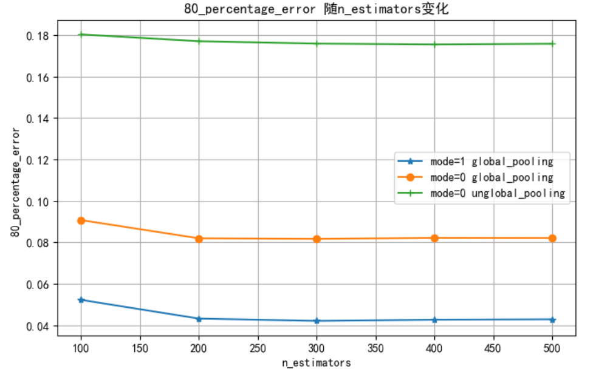
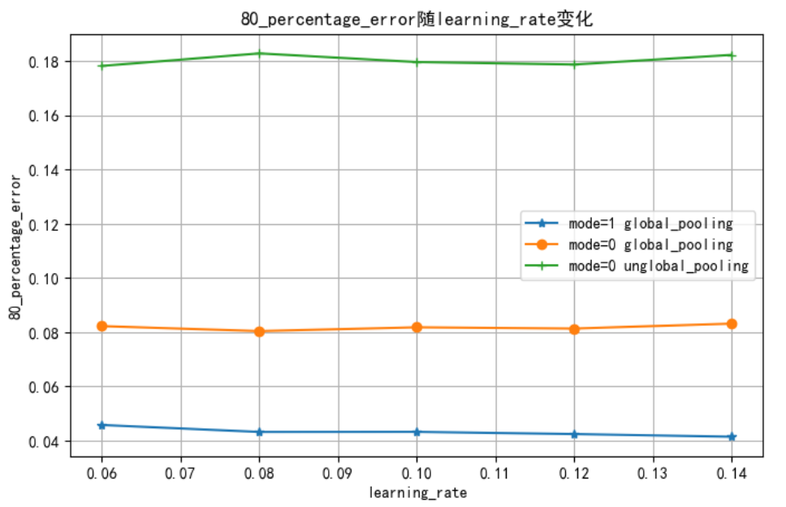
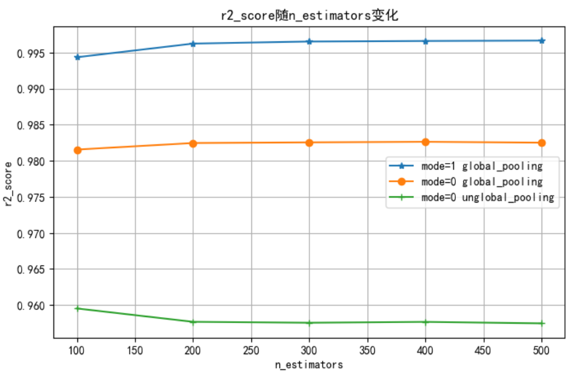
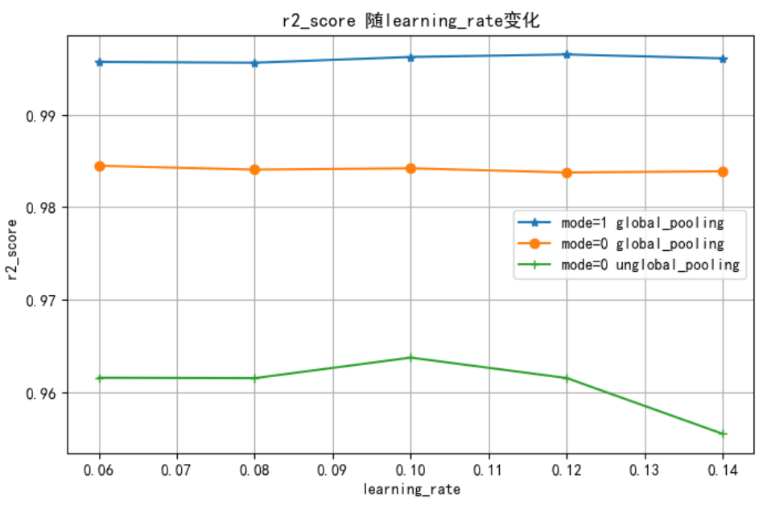

# Pooling算子模型分析报告
## 模型选择
+ 结合《算子特征分析报告》，阐述选择模型的理由
  + Pooling算子包括flops，window_h，window_w，stride_h，stride_w等特征特征数量较多，数据类型单一，适用于机器学习模型建模
  + 通过选用xgboost，RandomForest，GradientBoosting，ExtraTrees等模型，在迭代次数或者是学习率相近的情况下，xgboost模型训练效果以及泛化能力方面要略优与其他模型。
## 模型调优
+ 讨论不同的算子特征、模型类别和模型性能的关系，绘制相关曲线图（图片请归档于各算子对应的image文件夹下）
+ 可以对比多个模型，选择最终的选型。优先选择复杂度低，容量小的模型
  + 通过选用xgboost，RandomForest，GradientBoosting，ExtraTrees等模型进行比对，xgboost模型的效果要略优于其他模型。
  + 超参数方面，采用xgboost模型，在不同场景下(即参数mode和global_pooling的不同取值)，通过比对不同的learning_rate和n_estimators，得到以下结果。
  + （1）不同场景下，80_percentage_error随n_estimators的变化关系，图片链接：
  + （2）不同场景下，80_percentage_error随learning_rate的变化关系，图片链接：
  + （3）不同场景下， r2_score随n_estimators的变化关系，图片链接：
  + （4）不同场景下， r2_score随learning_rate的变化关系，图片链接：

  + 通过以上超参数比较，学习率为0.11，max_depth为6，subsample为0.9，colsample_bytree为1以及n_estimators达到300以上即可达到较为理想的结果。
    

