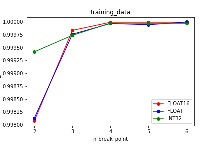
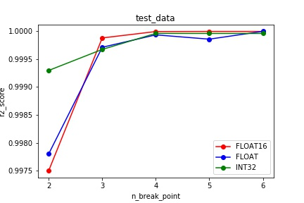
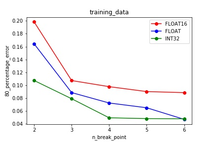
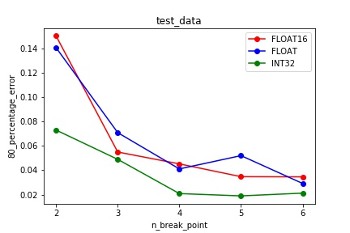

# Relu6算子模型分析报告
## 模型选择
+ 首先Relu6算子的计算公式为：
  $$
  Y=min(max(0,x),6)
  $$
  其次，算子的输出与输入的策略相同，即输出与输入的datatype、shape、format相同，无其他属性值。并且，根据对算子的特征分析得影响算子的最重要特征为FLOPS，所以在模型选择时选择了复杂度较低的机器学习模型，最终经过训练与测试后选择为分段线性回归模型。
## 模型调优
+ 在选择不同模型的过程中，发现分段线性回归模型对该算子的仿真建模效果极优；

+ 在对分段线性回归模型进行调优的过程中，我对模型的参数n_break_point进行了调整以测试模型的精确度，并进行了相关折线图的绘制。
+ 训练数据：r2_score与n_break_point的关系，图片链接：
+ 测试数据：r2_score与n_break_point的关系，图片链接：
+ 训练数据：80_percentage_error与n_break_point的关系，图片链接：
+ 测试数据：80_percentage_error与n_break_point的关系，图片链接：
+ 在对折线图进行分析之后，发现n_break_point的值处于4，5，6时能够得到表现比较优秀的精确度，综合结果选定为n_break_point=6。

  