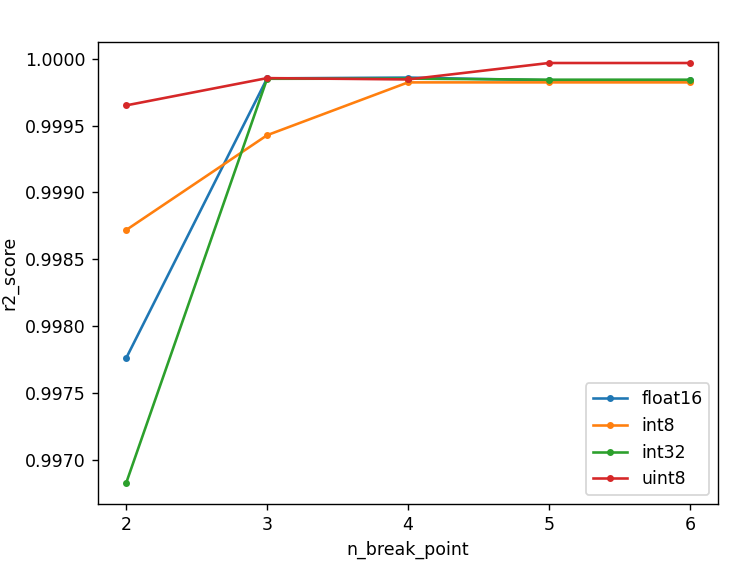
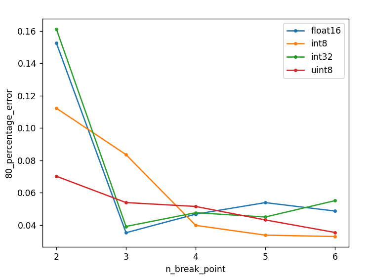

# 算子模型分析报告
## 模型选择
+ 因为特征为输入数据的元素个数，且复杂度较低，所以使用分段线性回归模型建模
## 模型调优
+ 
+ 在对线性回归模型，分段线性回归模型，线性函数曲线拟合，二次函数曲线拟合，SVM多个模型进行对比训练之后，最终选择了分段线性回归模型作为最终的模型
+ 在对分段线性回归模型进行调优的过程中，对模型的参数n_break_point进行了调整，来测试模型的精确度
+ n_break_point与r2_score的关系:图片链接：
+ n_break_point与80_percent_error的关系:图片链接：
+ 在对折线图进行了对比分析之后，将n_break_point参数选取为4